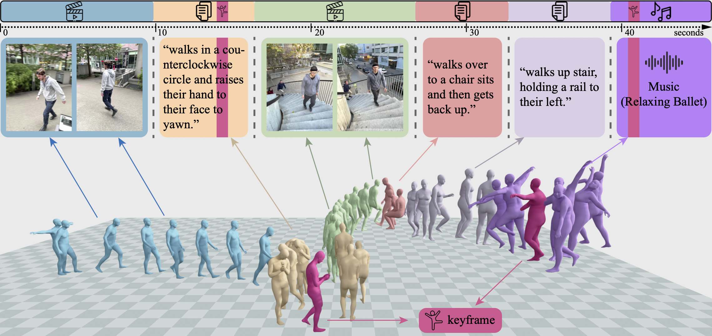

<p align="center">
  <h1 align="center">GEM: A Generalist Model for Human Motion</h1>
  <p align="center">
    <a href="https://jeffli.site/"><strong>Jiefeng Li</strong></a>
    ·
    <a href="https://www.jinkuncao.com/"><strong>Jinkun Cao</strong></a>
    ·
    <a href="https://cs.stanford.edu/~haotianz/"><strong>Haotian Zhang</strong></a>
    ·
    <a href="https://davrempe.github.io/"><strong>Davis Rempe</strong></a>
    ·
    <a href="https://jankautz.com/"><strong>Jan Kautz</strong></a>
    ·
    <a href="https://www.umariqbal.info/"><strong>Umar Iqbal</strong></a>
    ·
    <a href="https://ye-yuan.com/"><strong>Ye Yuan</strong></a>
  </p>
  <h2 align="center">ICCV 2025 (Highlight)</h2>
  <div align="center">
    
  </div>
</p>
<p align="center">
  <a href="https://research.nvidia.com/labs/dair/gem/"></a>
  <a href="https://arxiv.org/abs/2505.01425"></a>
  <a href="LICENSE"></a>
</p>

GEM is a unified generative framework for human motion estimation and generation. GEM accepts multiple conditioning modalities — video, 2D keypoints, text, and audio — and handles multiple tasks without task-specific heads.

> For full-body motion estimation (hands + face), see [GEM-X](https://github.com/NVlabs/GEM-X).

---

## 📰 News
- **[March 2026]** 📢 **GEM-SMPL** is released with a multi-modal demo script.
- **[December 2025]** 📢 GENMO has been renamed to **GEM**.
- **[October 2025]** 📢 The **GEM** codebase is **released!**.

---

## 🚀 Quick Start

```bash
pip install uv && uv venv .venv --python 3.10 && source .venv/bin/activate
uv pip install torch torchvision --index-url https://download.pytorch.org/whl/cu124
bash scripts/install_env.sh
python scripts/demo/demo_smpl.py --input_list path/to/video.mp4 "text:a person walks forward" --ckpt_path inputs/pretrained/gem_smpl.ckpt
```

For full installation instructions (body model, checkpoints), see [docs/INSTALL.md](docs/INSTALL.md).

---

## 📦 Pretrained Models

| Model | Body Model | Description | Download |
|-------|-----------|-------------|----------|
| GEM-SMPL | SMPL | Regression + generation (text/audio/music/video) | [HuggingFace](https://huggingface.co/nvidia/GEM-X) |

Place checkpoints under `inputs/pretrained/` or pass the path directly via `--ckpt_path`. The demo scripts will automatically download the checkpoint from HuggingFace if `--ckpt` is not provided.

---

## 🎬 Demo

### Multi-modal demo (video + text)

The main demo supports mixed video and text conditioning — the core contribution of GEM.

**Video + inline text:**
```bash
python scripts/demo/demo_smpl.py \
  --input_list video1.mp4 "text:a person acting like a monkey" video2.mp4 \
  --ckpt_path inputs/pretrained/gem_smpl.ckpt
```

**Video + text file:**
```bash
python scripts/demo/demo_smpl.py \
  --input_list video1.mp4 prompt.txt video2.mp4 \
  --ckpt_path inputs/pretrained/gem_smpl.ckpt
```

**Multiple videos + multiple text prompts:**
```bash
python scripts/demo/demo_smpl.py \
  --input_list video1.mp4 "text:a person acting like a monkey" video2.mp4 "text:a person dances" \
  --ckpt_path inputs/pretrained/gem_smpl.ckpt
```

### Key arguments

| Argument | Default | Description |
|---|---|---|
| `--input_list` | — | Input list (required): `.mp4`/`.avi`/`.mov` files, `.txt` files, or `text:prompt` strings |
| `--ckpt_path` | `null` | Pretrained checkpoint path |
| `--text_length` | `300` | Number of frames for each text segment (300 = 10s at 30fps) |
| `--hmr2_ckpt` | `inputs/checkpoints/hmr2/epoch=10-step=25000.ckpt` | HMR2 checkpoint for image features |
| `-s` / `--static_cam` | off | Assume static camera |
| `--output_root` | `outputs` | Output directory |
| `--no_render` | off | Skip visualization, only save SMPL parameters |

### Outputs

Results are saved to `outputs/<first_video_name>_mix/`:

| File | Description |
|---|---|
| `1_incam.mp4` | In-camera mesh overlay |
| `2_global.mp4` | Global-coordinate render |
| `3_incam_global_horiz.mp4` | Side-by-side comparison |
| `smpl_params.pt` | SMPL parameters (`body_params_global`, `body_params_incam`, `K_fullimg`, `segment_info`) |

### Video-only demo

For simple pose estimation without text conditioning, use `demo_smpl_hpe.py`:

```bash
python scripts/demo/demo_smpl_hpe.py \
  --video path/to/video.mp4 \
  --ckpt_path inputs/pretrained/gem_smpl.ckpt
```

### Real-time webcam demo

`demo_webcam.py` runs the whole pipeline (YOLOX → ViTPose-H → HMR2 → GEM denoiser) frame-by-frame via ONNX Runtime, with a sliding window and streaming global rollout. See [docs/INSTALL.md](docs/INSTALL.md) Steps 8–10 for ONNX Runtime setup and ONNX export commands (one-time).

```bash
# Video file, OpenCV in-camera mesh overlay, no image features (fastest)
python scripts/demo/demo_webcam.py \
  --video path/to/video.mp4 --no_imgfeat \
  --render --render_mode opencv

# Webcam with Viser-based 3D world viewer (open http://localhost:8012)
python scripts/demo/demo_webcam.py \
  --camera_id 0 --no_imgfeat \
  --render --render_mode viser
```

| Flag | Default | Purpose |
|---|---|---|
| `--video` / `--camera_id` | camera 0 | input source |
| `--context_frames` | 120 | sliding-window length (must match exported denoiser `--seq_len`) |
| `--no_imgfeat` | off | use the no-imgfeat denoiser variant; skips HMR2 entirely |
| `--render_mode {opencv,viser}` | `viser` | mesh-overlay window vs web 3D viewer |
| `--no_async_pipeline` | off | force synchronous mode (lower throughput, zero pipeline lag) |

For per-module latency profiling: `python tools/benchmark/benchmark_modules.py`.

---

## 🏋️ Training

See [Dataset Preparation](docs/DATA.md) for download links and directory structure.

**Regression model** (video → SMPL):

```bash
python scripts/train.py exp=gem_smpl_regression
```

**Full model** (regression + text/audio generation):

```bash
python scripts/train.py exp=gem_smpl
```

**Multi-GPU (DDP)**:

```bash
python scripts/train.py exp=gem_smpl_regression pl_trainer.devices=4
```

**SLURM**:

```bash
python scripts/train_slurm.py exp=gem_smpl_regression
```

### Key settings

From `configs/exp/gem_smpl_regression.yaml`:

- Body model: SMPLx
- Optimizer: AdamW (lr=2e-4)
- Precision: 16-mixed
- Max steps: 500K
- Gradient clipping: 0.5
- Validation every 3000 steps

Logging uses W&B by default. To disable:

```bash
python scripts/train.py exp=gem_smpl_regression use_wandb=false
```

---

See [FAQ](docs/FAQ.md) for common issues.

---


## 🤝 Related Humanoid Work at NVIDIA
GEM is part of a larger effort to enable humanoid motion data for robotics, physical AI, and other applications.

Check out these related works:
* [GEM-X](https://github.com/NVlabs/GEM-X)
* [SOMA Body Model](https://github.com/NVlabs/SOMA-X)
* [BONES-SEED Dataset]()
* [ProtoMotions](https://github.com/NVlabs/ProtoMotions)
* [SOMA Retargeter]()
* [SONIC](https://github.com/NVlabs/GR00T-WholeBodyControl)
* [Kimodo](https://github.com/nv-tlabs/kimodo)


## 📖 Citation

```bibtex
@inproceedings{genmo2025,
  title     = {GENMO: A GENeralist Model for Human MOtion},
  author    = {Li, Jiefeng and Cao, Jinkun and Zhang, Haotian and Rempe, Davis and Kautz, Jan and Iqbal, Umar and Yuan, Ye},
  booktitle = {Proceedings of the IEEE/CVF International Conference on Computer Vision (ICCV)},
  year      = {2025}
}
```

---

## 📄 License

This project is released under the Apache 2.0 License — see [LICENSE](LICENSE) for details. Third-party components are subject to their own licenses; see [ATTRIBUTIONS.md](ATTRIBUTIONS.md) for specifics.
